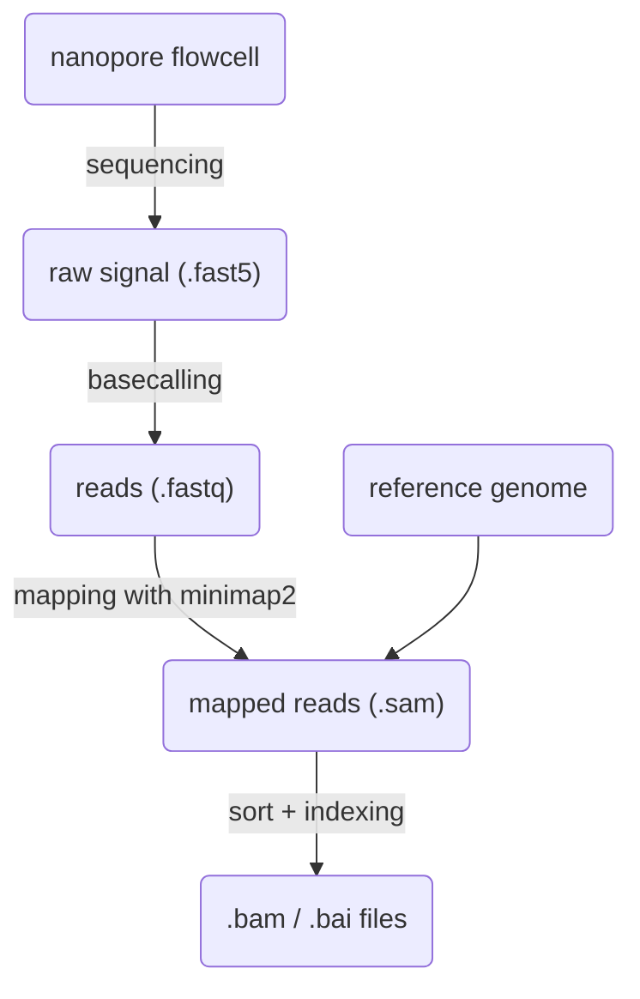

## From DNA to SAM/BAM files

The process that leads from raw reads to sam/bam files is:


The commands used to generate the sam/bam files are:
```
minimap2 -a -x map-ont -t 2 genome.fa reads.fastq.gz > reads.sam
samtools sort -@ 2 reads.sam > reads.sorted.bam
samtools index -@ 2 reads.sorted.bam
```
These requires the installation of `minimap2` and `samtools`. Using [conda](https://docs.conda.io/en/latest/) or [mamba](https://github.com/mamba-org/mamba) these can be installed using the provided environment `conda_envs/secmap.yml`. This environment also contains `jupyter-lab` and `pysam`. 

## Material and References

- Nanopore sequencing [paper](https://www.nature.com/articles/s41587-021-01108-x)

- Sam file format specifications: <https://samtools.github.io/hts-specs/SAMv1.pdf>, or for a summary see <https://davetang.org/wiki/tiki-index.php?page=SAM>.

- [IGV](https://software.broadinstitute.org/software/igv/) can be used to visualize mapped reads.

- We use `pysam` to parse SAM/BAM files (see the [documentation](https://pysam.readthedocs.io/en/latest/api.html)).

- The [pipeline](https://github.com/mmolari/morbidostat-genome-analysis) that we use to analyze the data produced by the morbidostat has some [notes](https://github.com/mmolari/morbidostat-genome-analysis/blob/main/notes/pipeline_description.md) describing the steps we use.

- Richard's [notes](https://neherlab.org/201707_qbio_computational_intro.html) on sequencing, mapping and assembly.

- [Pandas](https://pandas.pydata.org/docs/getting_started/intro_tutorials/index.html): a python library to create, manipulate and save dataframes.

## Example dataset

we start by looking at `vial_14/time_14` from the september 22 amoxicilin run.

The example dataset includes:
- fastq file with raw reads
- sam/bam/bai file with mappings
- reference genbank file

The location of fastq reads on the cluster is:
```
2022_morbidostat_shared_data/2022-09-21_neher_amoxicillin_run_september/vial_14/time_14/reads.fastq.gz
```
Which is a symlink to
```
/scicore/home/nccr-antiresist/GROUP/unibas/neher/experiments/2022-09-21_neher_amoxicillin_run_september/samples/D14V14/D14V14_FAU42973_25f71479_barcode12.fastq.gz
```

Mapped reads are instead in the `2022_morbidostat_shared_analysis` folder.

The test data folder contains the following files:
```
drwxr-xr-- 2 molari0000 neher 4.0K Jan 22 12:59 pileup
-r--r--r-- 1 molari0000 neher 234M Jan 22 13:02 reads.fastq.gz
-rwxr-xr-- 1 molari0000 neher 232M Jan 22 12:59 reads.sorted.bam
-rwxr-xr-- 1 molari0000 neher 108K Jan 22 12:59 reads.sorted.bam.bai
-rw-r--r-- 1 molari0000 neher 4.6M Jan 22 12:59 ref_genome.fa
-rw-r--r-- 1 molari0000 neher 9.4M Jan 22 12:59 ref_genome.gbk
```